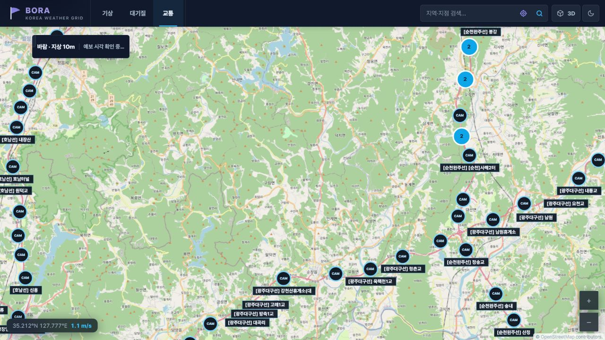
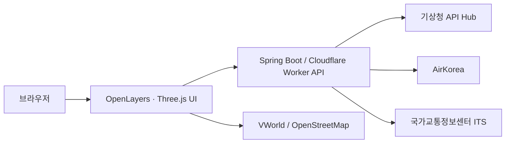

<p align="center">
  
</p>

<h1 align="center">BORA · Korea Weather Grid</h1>

<p align="center">
  숫자로 흩어진 기상 예보를 <strong>지도 위의 흐름과 변화</strong>로 보여주는 웹 애플리케이션입니다.<br>
  전국 격자부터 원하는 지점의 48시간 예보까지 한 화면에서 탐색할 수 있습니다.
</p>

<p align="center">
  <a href="https://bora-weather.dlwnstndlwld.workers.dev"><strong>웹에서 바로 사용하기</strong></a>
  ·
  <a href="#빠르게-사용하기">사용 방법</a>
  ·
  <a href="#로컬에서-실행하기">로컬 실행</a>
</p>


## 프로젝트 소개

날씨 API를 화면에 붙여 보면 값 자체는 쉽게 확인할 수 있지만, **어디에서 강해지고 어느 방향으로
이동하는지**는 숫자만으로 파악하기 어렵습니다. BORA는 이 차이를 줄이기 위해 시작했습니다.

격자 예보를 색상과 흐름선으로 표현하고, 같은 시각의 대기질·도로 상황·위험기상을 겹쳐 볼 수
있도록 구성했습니다. 기능을 늘리는 것보다 사용자가 현재 보고 있는 값과 시각, 단위, 출처를
놓치지 않게 만드는 데 더 신경 썼습니다.

## 핵심 기능

| 기능 | 할 수 있는 일 |
|---|---|
| 전국 기상 격자 | 바람, 기온, 강수·눈, 일사, 습도, 하늘상태, 파고를 색상·흐름선·등치선으로 비교 |
| 48시간 시간축 | 현재 발표 자료를 기준으로 예보 시각을 한 시간 단위로 이동하거나 자동 재생 |
| 지점별 예보 | 지역명 또는 위·경도로 원하는 지점의 풍향·풍속과 시간대별 상세예보 확인 |
| 대기질 | AirKorea PM10·PM2.5 관측값과 같은 시각의 바람 흐름을 함께 확인 |
| 교통 | 지도 축척에 맞춰 ITS 도로 CCTV 위치를 조회하고 선택한 영상만 재생 |
| 3D 지도 | 선택한 기상 격자를 지형 또는 지구본 위에서 회전·확대하며 탐색 |
| 지도 도구 | 거리 측정, 대표 지점 표시, 배경지도 선택, 밝은·어두운 테마 전환 |

## 실제 동작 화면

아래 이미지는 **2026년 7월 26일 배포된 BORA를 브라우저에서 직접 조작해 캡처한 화면**입니다.
예보 시각과 관측값은 접속 시점 및 제공기관의 갱신 상태에 따라 달라집니다.

### 전국 분포 비교

바람은 흐름선으로 이동 방향을, 기온과 일사는 색상 및 구간별 비율로 전국 분포를 보여줍니다.
하단 시간축을 움직이면 같은 요소가 향후 48시간 동안 어떻게 달라지는지 비교할 수 있습니다.

<table>
  <tr>
    <td width="50%">
      
      <p align="center"><strong>기온 분포</strong><br>격자별 기온과 구간별 비율</p>
    </td>
    <td width="50%">
      
      <p align="center"><strong>일사 강도</strong><br>지면 하향단파복사의 공간 분포</p>
    </td>
  </tr>
</table>

### 대기질과 도로 상황

대기질 화면은 측정소를 등급별로 묶어 보여주고, 바람 흐름을 함께 표시해 주변 상황을 빠르게
비교할 수 있게 했습니다. 교통 화면은 현재 지도 범위에 포함된 CCTV만 요청해 지도 복잡도와
불필요한 네트워크 사용을 줄였습니다.

<table>
  <tr>
    <td width="50%">
      
      <p align="center"><strong>PM2.5 대기질</strong><br>측정소 등급과 바람 흐름</p>
    </td>
    <td width="50%">
      
      <p align="center"><strong>도로 CCTV</strong><br>현재 지도 범위의 CCTV 위치</p>
    </td>
  </tr>
</table>

### 지역별 48시간 예보


지역 검색 결과는 지도 이동으로 끝내지 않고, 선택 지점의 시계열과 시간대별 상세예보까지
한 번에 엽니다. 차트에는 첫 예보값, 48시간 범위, 대표 풍향을 먼저 보여주고 원본 수치도
별도로 확인할 수 있게 구성했습니다.

### 3D 기상 지도


현재 선택한 격자를 입체 지형 또는 지구본으로 전환할 수 있습니다. 드래그 회전, 휠 확대,
우클릭 이동을 지원하며 표면의 좌표와 값을 직접 확인할 수 있습니다.

## 빠르게 사용하기

1. 상단에서 `기상`, `대기질`, `교통` 중 확인할 영역을 선택합니다.
2. 기상 화면에서는 `바람`, `기온`, `강수·눈`, `일사`, `위험기상`을 전환합니다.
3. 화면 아래 시간축을 움직여 같은 요소의 예보 변화를 비교합니다.
4. 검색창에 지역명을 입력하거나 위·경도를 지정해 지점별 48시간 예보를 엽니다.
5. 더 자세히 보고 싶다면 `설정`에서 표현 방식을 바꾸거나 `3D` 지도를 사용합니다.

> 외부 자료를 불러오지 못해도 화면 전체를 막지 않고, 해당 기능에 오류 안내와 재시도 방법을
> 표시합니다. VWorld 배경지도를 사용할 수 없는 환경에서는 OpenStreetMap으로 전환됩니다.

## 구성



- **Frontend**: OpenLayers, Three.js, JavaScript, CSS
- **Backend**: Java 17, Spring Boot 4, Cloudflare Workers
- **Test**: JUnit, Node.js test runner, Playwright E2E
- **운영 원칙**: API 키는 서버 환경변수로만 주입하고 브라우저나 저장소에 포함하지 않습니다.

Spring과 Cloudflare 배포가 같은 UI 자산과 DOM 계약을 사용하도록 구성해, 실행 환경이 달라도
기능과 접근성 동작이 달라지지 않도록 관리합니다.

## 로컬에서 실행하기

JDK 17이 필요합니다. 외부 API 키 없이 UI와 상호작용을 확인하려면 데모 모드로 실행합니다.

```powershell
$env:WEATHER_GRID_DEMO_MODE = "true"
.\gradlew.bat bootRun --args='--server.port=8080'
```

macOS 또는 Linux에서는 다음 명령을 사용할 수 있습니다.

```bash
WEATHER_GRID_DEMO_MODE=true ./gradlew bootRun --args='--server.port=8080'
```

실행 후 [http://localhost:8080](http://localhost:8080)을 엽니다. 기본 테스트는 다음과 같이
실행합니다.

```powershell
.\gradlew.bat test
```

### 실제 데이터 연결

개인 키 파일을 저장소에 커밋하지 말고 환경변수로 주입합니다.

| 환경변수 | 용도 | 필수 여부 |
|---|---|---|
| `KMA_API_AUTH_KEY` | 기상청 API Hub | 필수 |
| `DATA_GO_KR_SERVICE_KEY` | AirKorea 등 공공데이터포털 API | 필수 |
| `ITS_API_KEY` | 국가교통정보센터 CCTV | 필수 |
| `VWORLD_API_KEY` | VWorld 배경지도 및 벡터 도로 | 선택 |

VWorld 키에는 실제 실행 도메인을 등록하고 필요한 2D 지도·배경지도·WMTS/TMS 권한을
허용해야 합니다.

## 데이터 출처와 이용 시 주의사항

| 데이터 | 출처 |
|---|---|
| 기상 예보·위험기상 | [기상청 API Hub](https://apihub.kma.go.kr/) |
| 대기질 | [한국환경공단 AirKorea](https://www.airkorea.or.kr/) |
| 도로 CCTV | [국가교통정보센터 ITS](https://www.its.go.kr/opendata/) |
| 배경지도·도로 | [VWorld](https://www.vworld.kr/), [OpenStreetMap contributors](https://www.openstreetmap.org/copyright) |
| 지도 경계 | [Natural Earth](https://www.naturalearthdata.com/) |

지도 경계는 시각화를 위한 자료이며 법적·지적 경계를 대신하지 않습니다. 기상 및 대기질
정보는 안전이나 생명을 좌우하는 단독 판단 근거로 사용하지 말고 제공기관의 공식 발표를 함께
확인해 주세요.

## 문서

- [현재 제공 범위와 알려진 제한](docs/known-limitations.md)
- [기여 방법과 독립 구현 원칙](CONTRIBUTING.md)
- [보안 문제 비공개 신고](SECURITY.md)
- [외부 라이브러리와 데이터 고지](THIRD_PARTY_NOTICES.md)
