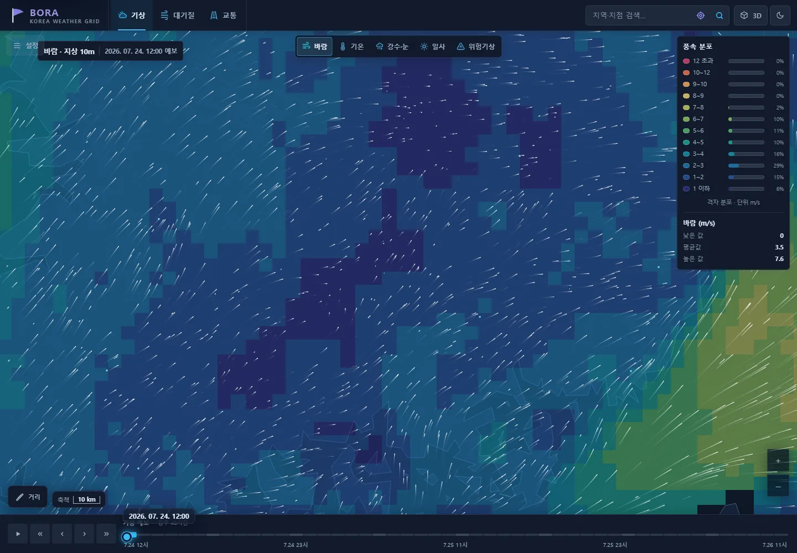
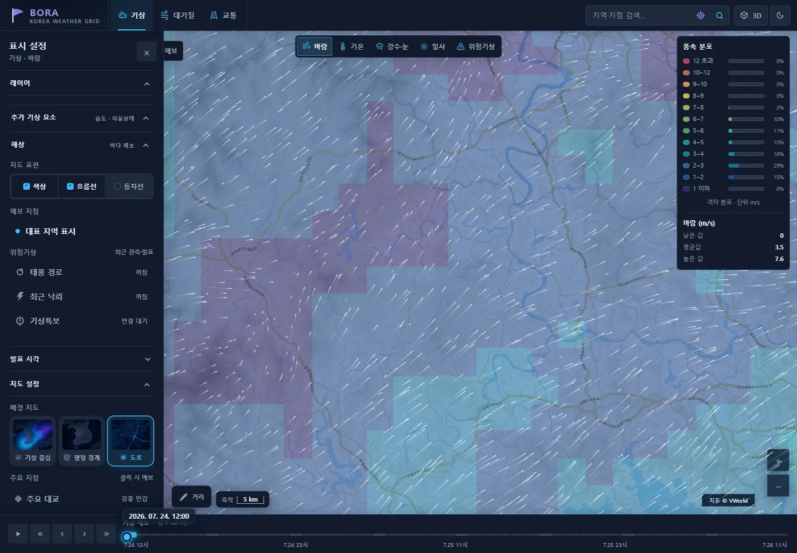
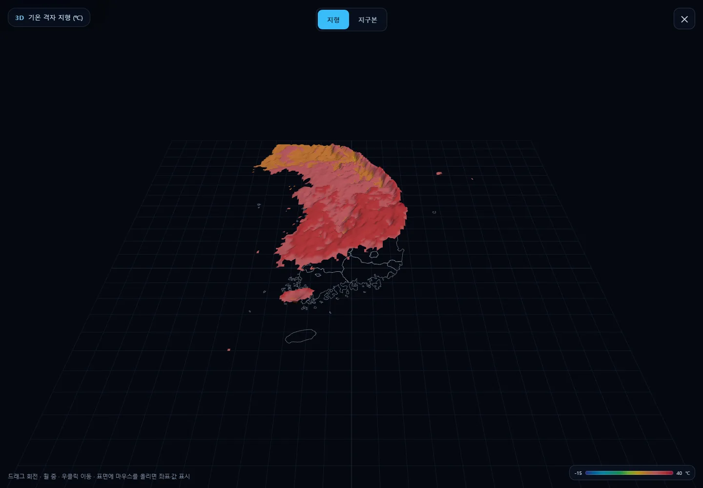
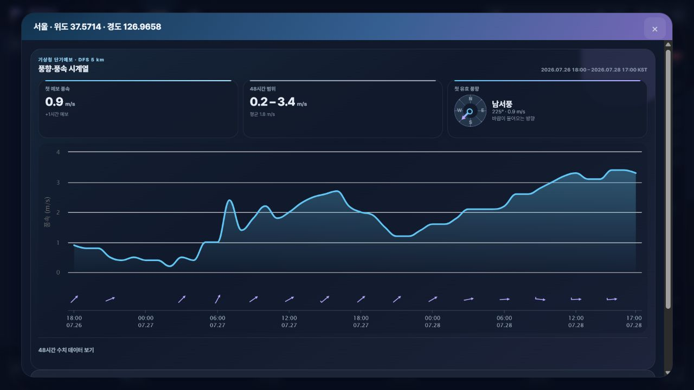

<p align="center">
  
</p>

<h1 align="center">BORA · Korea Weather Grid</h1>

<p align="center">
  전국 기상 격자와 주변 환경 정보를 지도 위에서 탐색하는 웹 애플리케이션입니다.<br>
  바람의 흐름, 시간에 따른 예보 변화, 지역별 상세 정보를 한 화면에서 확인할 수 있습니다.
</p>

<p align="center">
  <a href="https://bora-weather.dlwnstndlwld.workers.dev/"><strong>웹에서 BORA 열기</strong></a>
  &nbsp;·&nbsp;
  <a href="#로컬에서-실행하기">로컬 실행</a>
  &nbsp;·&nbsp;
  <a href="docs/known-limitations.md">제공 범위</a>
</p>


<table>
  <tr>
    <td width="25%" align="center"><strong>9개 기상 요소</strong><br><sub>바람 · 기온 · 강수량 · 강수형태 · 적설 · 습도 · 하늘 · 파고 · 일사</sub></td>
    <td width="25%" align="center"><strong>48시간 탐색</strong><br><sub>시간축과 발표 시각 이동</sub></td>
    <td width="25%" align="center"><strong>3가지 지도 투영</strong><br><sub>기상청 LCC · 메르카토르 · 위경도</sub></td>
    <td width="25%" align="center"><strong>2D · 3D 보기</strong><br><sub>지도 · 지형 · 지구본</sub></td>
  </tr>
</table>

## 실제 동작 화면



<p align="center"><sub>풍속 색상과 흐름선을 함께 표시하고, 아래 시간축으로 예보 시각을 이동합니다.</sub></p>

<table>
  <tr>
    <td width="50%">
      
    </td>
    <td width="50%">
      
    </td>
  </tr>
  <tr>
    <td align="center"><strong>VWorld 도로 지도</strong><br><sub>배경지도와 기상 레이어를 함께 비교</sub></td>
    <td align="center"><strong>3D 기상 지형</strong><br><sub>회전 · 확대 · 지형/지구본 전환</sub></td>
  </tr>
</table>



<p align="center"><sub>지역을 검색하거나 지도를 선택하면 풍향·풍속 차트와 시간대별 상세예보를 엽니다.</sub></p>

## 제공 기능

| 영역 | 확인할 수 있는 정보 |
|---|---|
| 기상 지도 | 풍향·풍속, 기온, 1시간 강수량, 강수형태, 1시간 신적설, 상대습도, 하늘상태, 파고, 하향단파복사 |
| 지도 표현 | 구간별 색상, 바람 흐름선, 등치선, 값 분포 범례, 대표 지역, 거리 측정 |
| 시간·지역 | +1~+48시간 예보, 발표 시각 이동, 지역·위경도 검색, 지점별 차트와 상세 카드 |
| 지도 보기 | 기상청 격자 LCC, Web Mercator, 위경도, VWorld 도로, 행정 경계, 3D 지형과 지구본 |
| 주변 정보 | AirKorea PM10·PM2.5, ITS 도로 CCTV, 기상특보, 태풍 경로, 최근 낙뢰 |

## 사용 방법

1. 상단에서 `기상`, `대기질`, `교통` 중 원하는 영역을 선택합니다.
2. 기상 요소와 `색상`·`흐름선`·`등치선`을 조합하고, 아래 시간축으로 예보를 이동합니다.
3. 지역을 검색해 상세예보를 열거나 `3D` 버튼으로 현재 분포를 입체적으로 살펴봅니다.

## 로컬에서 실행하기

JDK 17이 필요합니다. 외부 API 키 없이 화면을 살펴보려면 데모 모드로 실행합니다.

```powershell
$env:WEATHER_GRID_DEMO_MODE = "true"
.\gradlew.bat bootRun
```

macOS와 Linux에서는 다음 명령을 사용합니다.

```bash
WEATHER_GRID_DEMO_MODE=true ./gradlew bootRun
```

브라우저에서 [http://localhost:8080](http://localhost:8080)을 엽니다. 데모 모드에서는
바람·기온·일사 샘플과 주요 화면 동작을 확인할 수 있습니다.

<details>
<summary><strong>실데이터 연결에 필요한 환경변수</strong></summary>

| 환경변수 | 연결 대상 |
|---|---|
| `KMA_API_AUTH_KEY` | 기상청 API Hub |
| `DATA_GO_KR_SERVICE_KEY` | AirKorea 등 공공데이터포털 |
| `ITS_API_KEY` | 국가교통정보센터 CCTV |
| `VWORLD_API_KEY` | VWorld 배경지도와 벡터 도로 |

키는 저장소 파일에 넣지 않고 실행 환경에 주입합니다. VWorld 키는 서버의 동일 출처 타일
프록시에서만 사용하며 브라우저 응답에는 포함하지 않습니다. VWorld를 사용할 때는 실제 실행
주소와 2D 지도·배경지도·WMTS/TMS 권한을 등록해야 합니다.

</details>

## 데이터 출처와 이용 안내

| 데이터 | 제공기관 |
|---|---|
| 기상 예보·수치자료 | [기상청 API Hub](https://apihub.kma.go.kr/) |
| 대기질 | [한국환경공단 AirKorea](https://www.airkorea.or.kr/) |
| 도로 CCTV | [국가교통정보센터 ITS](https://www.its.go.kr/) |
| 배경지도·경계 | [VWorld](https://www.vworld.kr/), [OpenStreetMap](https://www.openstreetmap.org/copyright), Natural Earth |

외부 자료는 제공기관의 갱신 시각과 통신 상태에 따라 달라질 수 있습니다. 지도 경계는
시각화를 위한 자료이며 법적·지적 경계를 뜻하지 않습니다. 기상 정보는 안전을 좌우하는
단독 판단 근거로 사용하지 말고 제공기관의 공식 발표를 함께 확인해 주세요.

현재 연결 조건과 알려진 제한은 [제공 범위 문서](docs/known-limitations.md)에서 확인할 수
있습니다. 이 저장소에는 별도 오픈소스 라이선스가 부여되지 않았으므로 재사용 전 저장소
소유자의 허가가 필요합니다.

---

<p align="center">
  <a href="CONTRIBUTING.md">기여 안내</a>
  &nbsp;·&nbsp;
  <a href="SECURITY.md">보안 신고</a>
  &nbsp;·&nbsp;
  <a href="THIRD_PARTY_NOTICES.md">외부 라이브러리·데이터 고지</a>
</p>
