<p align="center">
  
</p>

<h1 align="center">BORA</h1>

<p align="center">
  기상청 격자 예보를 <strong>지도 위의 색과 흐름</strong>으로 바꿔 보는 웹 지도입니다.<br>
  전국 분포부터 우리 동네 48시간 예보까지 한 화면에서 넘겨봅니다.
</p>

<p align="center">
  <a href="https://bora-weather.dlwnstndlwld.workers.dev"><strong>바로 써보기 →</strong></a>
  &nbsp;·&nbsp;
  <a href="#처음-열었다면-이-순서로">사용 순서</a>
  &nbsp;·&nbsp;
  <a href="#내-컴퓨터에서-실행하기">직접 실행</a>
</p>

<br>

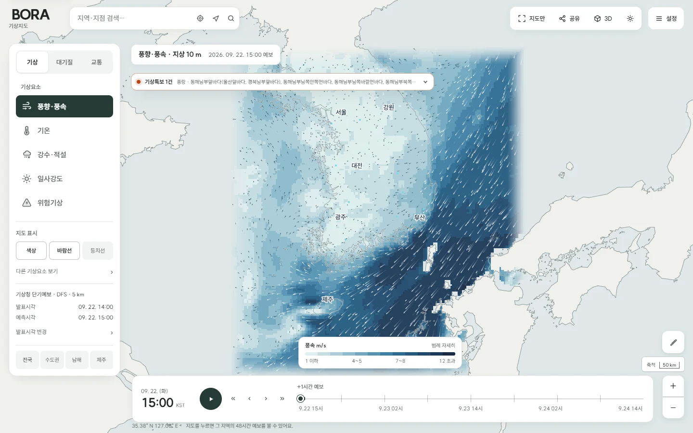

<br>

## 왜 만들었나

날씨 앱은 "지금 서울 3.5m/s"는 잘 알려주는데, **어디에서 강해지고 어느 쪽으로 밀려오는지**는
알려주지 않습니다. 저는 그게 궁금해서 기상청 격자 예보를 그대로 지도에 깔아봤습니다.

숫자를 표로 늘어놓는 대신 색과 흐름으로 보여주고, 지금 보고 있는 값이 **언제 발표된 몇 시
예보인지** 화면에서 눈을 떼지 않고 알 수 있게 만드는 데 제일 신경 썼습니다.

<br>

## 바람이 어떻게 흐르는지 보입니다

색은 풍속, 흐름선은 공기가 밀려가는 방향입니다. 서해에서 올라오는 흐름과 남해의 강한 바람대가
갈라지는 지점이 눈에 바로 들어옵니다.

<p align="center">
  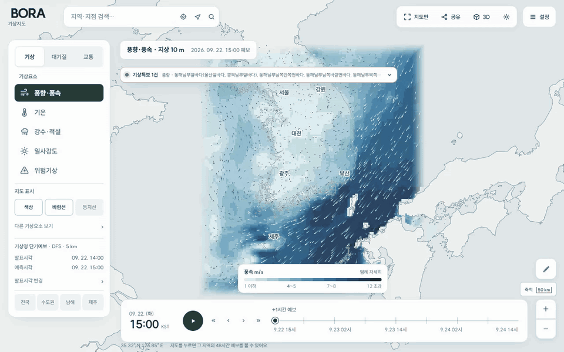
</p>

> 흐름선의 이동 속도는 방향을 읽기 위한 시각화이고, 실제 풍속은 색과 범례로 확인합니다.

<br>

## 48시간을 그냥 넘겨봅니다

아래 시간축을 끌거나 재생 버튼을 누르면 같은 요소가 시간에 따라 어떻게 달라지는지 이어서 보입니다.
범례의 구간별 비율과 최저·평균·최고값도 시각마다 같이 바뀝니다.

<p align="center">
  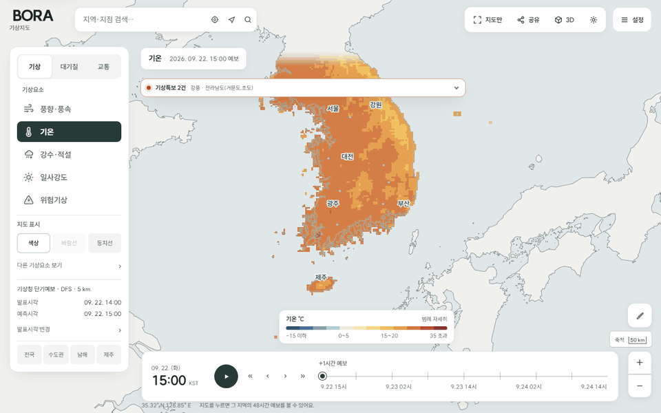
</p>

<br>

## 무엇을 볼 수 있나

| | 볼 수 있는 것 |
|---|---|
| **기상** | 바람, 기온, 강수량·강수형태·신적설, 일사강도, 상대습도, 하늘상태, 파고 |
| **대기질** | AirKorea 측정소의 PM10·PM2.5 최신 관측값과 등급 |
| **교통** | 지도를 확대하면 그 범위의 도로 CCTV 위치, 선택한 카메라만 재생 |
| **위험기상** | 태풍 경로, 최근 낙뢰, 발효 중인 기상특보 |
| **지점 예보** | 지역 검색·현재 위치·위경도로 고른 한 지점의 48시간 시계열 |
| **지도 도구** | 거리 측정, 3D 보기, 배경지도 3종, 현재 화면 링크 공유, 밝은·어두운 화면 |

아래 화면은 전부 **2026년 7월 30일에 실제로 조회한 결과**입니다. 예보값은 접속 시점과 기상청
발표 상황에 따라 당연히 달라집니다.

<table>
  <tr>
    <td width="50%">
      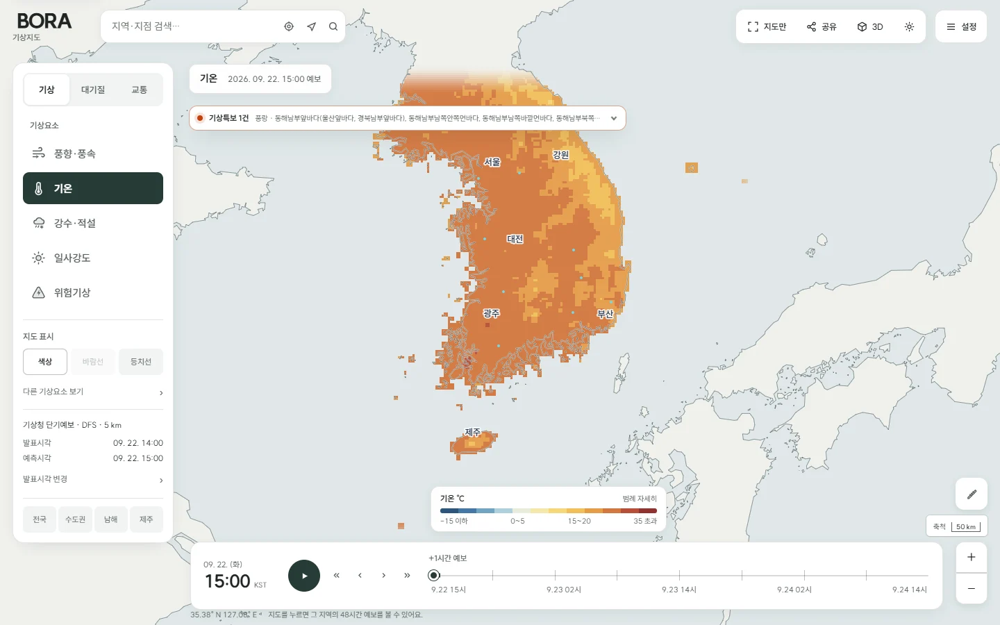
      <p align="center"><strong>기온</strong><br>격자별 기온과 구간별 비율</p>
    </td>
    <td width="50%">
      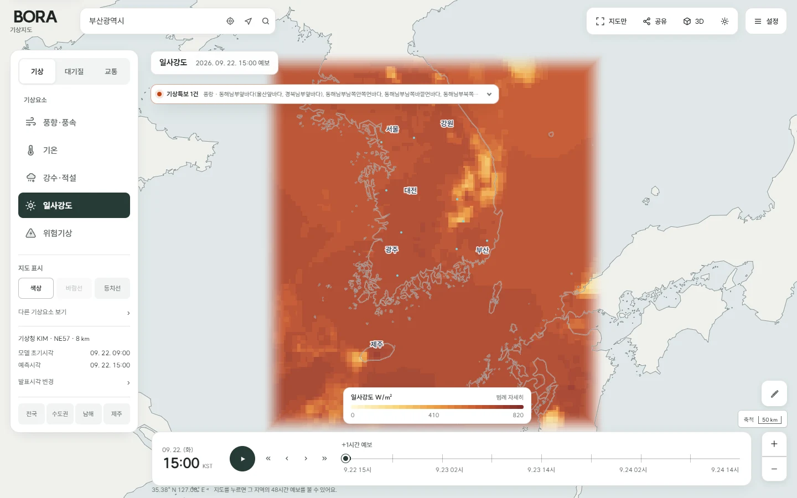
      <p align="center"><strong>일사강도</strong><br>지면에 닿는 태양 복사량</p>
    </td>
  </tr>
</table>

### 대기질과 도로 상황

`대기질`은 측정소를 등급별로 묶어 보여주고 같은 시각의 바람 흐름을 같이 깔아 둡니다.
농도가 어디서 밀려오는지 짐작해 보기 좋습니다.
`교통`은 지도를 확대한 범위의 CCTV만 불러오고, 영상은 카메라를 고르고 재생을 누른 뒤에만
연결합니다.

<table>
  <tr>
    <td width="50%">
      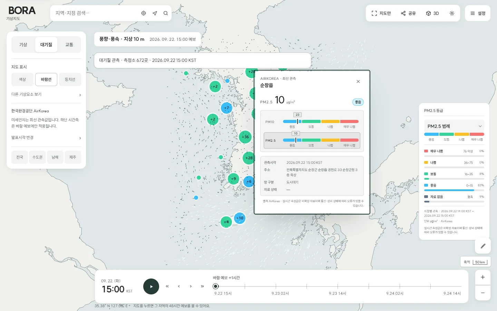
      <p align="center"><strong>PM2.5 대기질</strong><br>측정소 등급 · 관측시각 표기</p>
    </td>
    <td width="50%">
      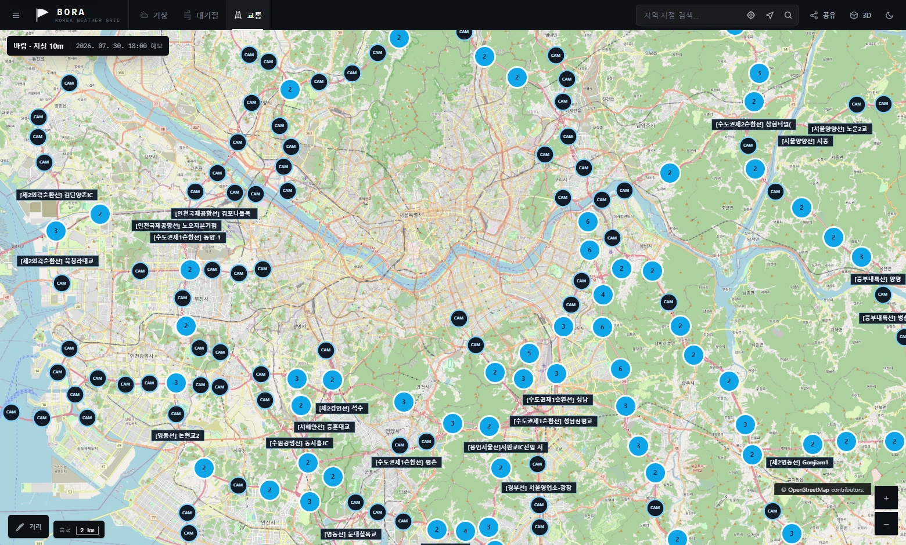
      <p align="center"><strong>도로 CCTV</strong><br>현재 화면 범위의 카메라만 조회</p>
    </td>
  </tr>
</table>

### 색이 아니라 선으로 보고 싶을 때

왼쪽 `설정`에서 표현 방식을 바꿀 수 있습니다. 색을 끄고 **등치선**만 켜면 같은 풍속을 잇는 선과
값이 남아, 기압골처럼 흐름의 골짜기를 찾기 편합니다.

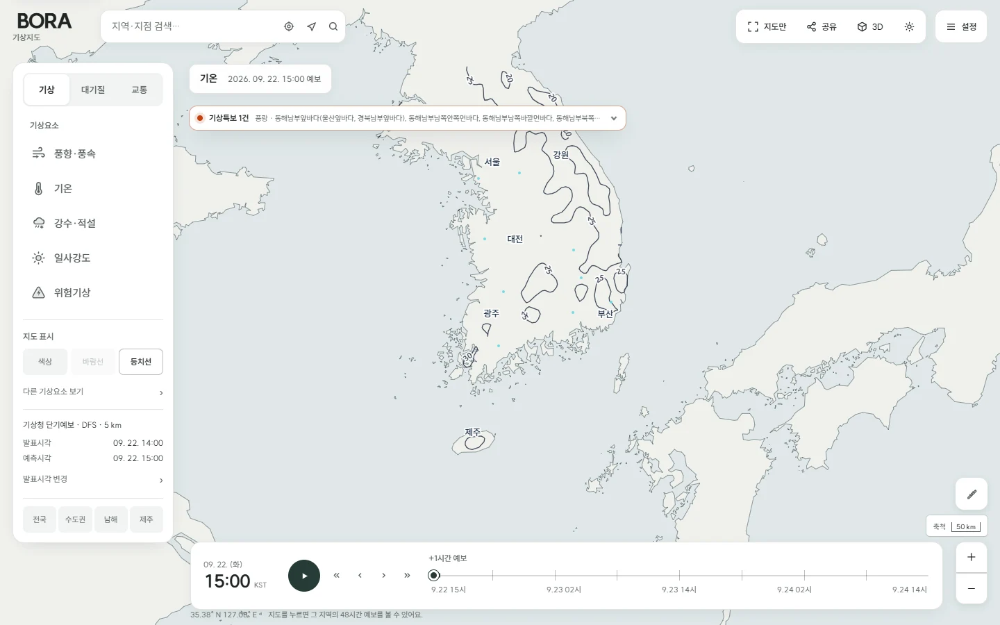

<br>

## 한 지점만 자세히

지역을 검색하거나 지도를 클릭하면 그 지점의 48시간이 열립니다. 첫 예보값, 48시간 변동 폭, 대표
풍향을 먼저 보여주고 원본 수치는 접어 두었습니다.

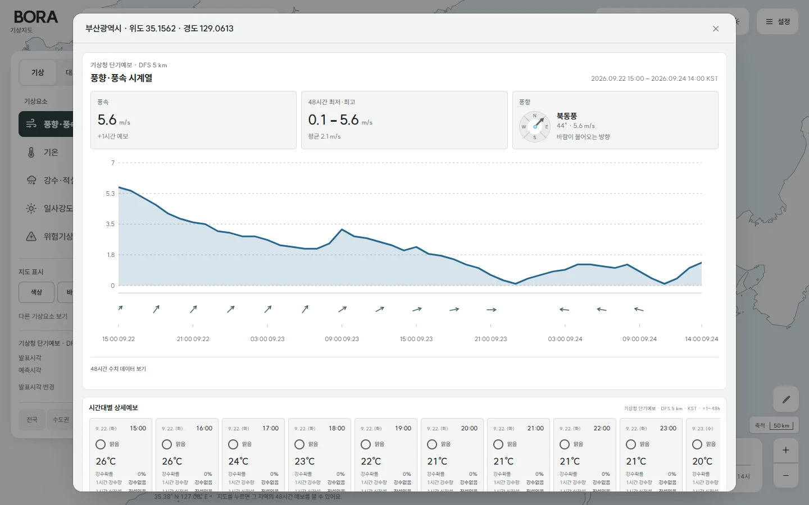

<br>

## 3D로도 봅니다

풍속을 높이로 세운 **지형 보기**와, 한반도를 둘러싼 맥락을 보는 **지구본 보기**가 있습니다.
드래그로 돌리고 휠로 당기며, 표면에 마우스를 올리면 그 지점의 좌표와 값이 나옵니다.

<table>
  <tr>
    <td width="50%">
      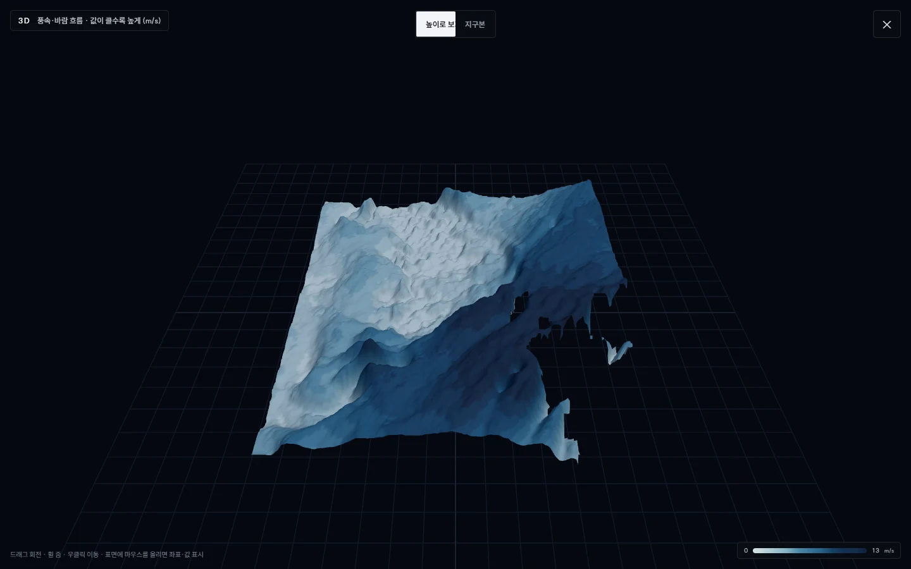
      <p align="center"><strong>지형</strong><br>풍속을 높이로 세운 표면</p>
    </td>
    <td width="50%">
      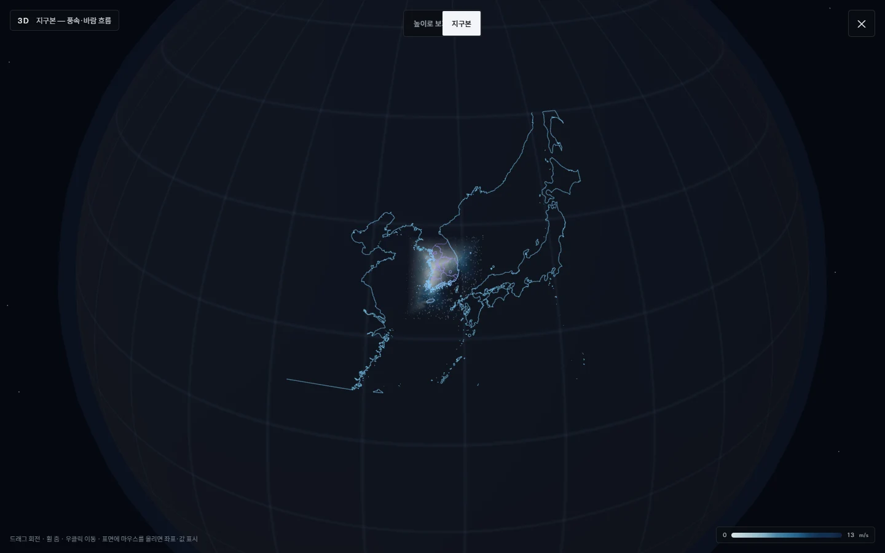
      <p align="center"><strong>지구본</strong><br>주변 지역까지 보는 맥락 보기</p>
    </td>
  </tr>
</table>

<br>

## 지도 위에서 바로 쓰는 것들

<table>
  <tr>
    <td width="50%">
      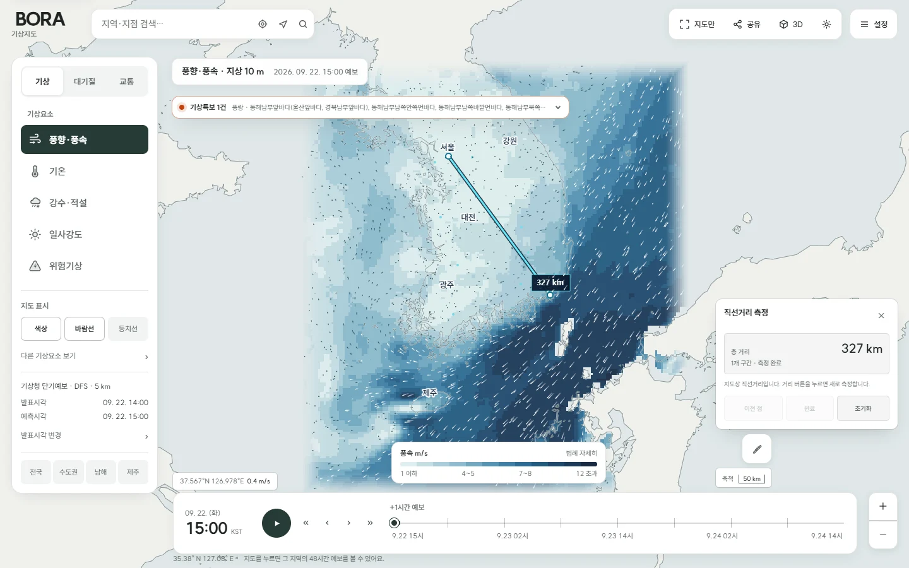
      <p align="center"><strong>거리 측정</strong><br>클릭한 지점들의 직선거리 합계</p>
    </td>
    <td width="50%">
      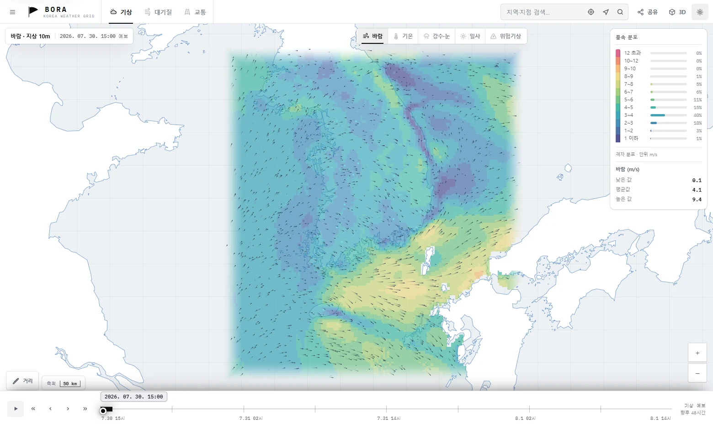
      <p align="center"><strong>밝은 화면</strong><br>지도 색까지 함께 바뀜</p>
    </td>
  </tr>
</table>

<br>

## 휴대폰에서도 씁니다

작은 화면에서는 설정이 아래에서 올라오는 시트로 바뀌고, 범례는 접힌 상태로 시작합니다.
핀치 줌·두 손가락 조작이 지도만 확대하고 페이지는 건드리지 않습니다.

<p align="center">
  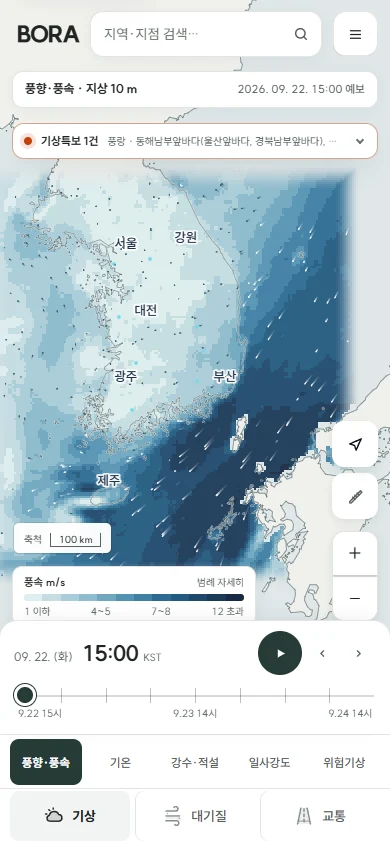
  &nbsp;&nbsp;
  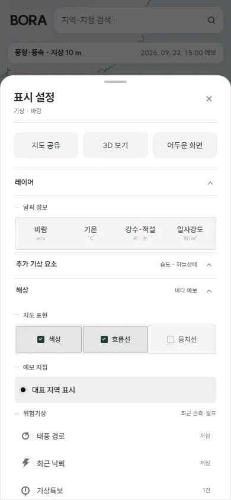
</p>

<br>

## 처음 열었다면 이 순서로

1. 위쪽에서 `기상` · `대기질` · `교통` 중 볼 것을 고릅니다.
2. 기상이면 지도 위 `바람` · `기온` · `강수·눈` · `일사` · `위험기상`을 눌러 요소를 바꿉니다.
3. 아래 **시간축**을 끌어 같은 요소의 앞뒤 시각을 비교합니다. 재생 버튼(`Space`)으로 이어 볼 수도 있습니다.
4. 궁금한 지역을 검색하거나 지도를 클릭해 **그 지점의 48시간**을 엽니다.
5. `공유`를 누르면 지금 보고 있는 위치·확대·요소·시각이 담긴 링크가 복사됩니다.

표현 방식(색·흐름선·등치선), 배경지도, 발표 시각을 바꾸려면 왼쪽 위 `설정`을 엽니다.

> 외부 자료를 못 불러와도 화면 전체가 멈추지 않습니다. 해당 기능 자리에만 안내와 `다시 시도`가
> 나오고 나머지는 계속 쓸 수 있습니다.

<br>

## 데이터는 어디서 오나

| 무엇 | 출처 |
|---|---|
| 기상 예보 · 태풍 · 낙뢰 | [기상청 API 허브](https://apihub.kma.go.kr/) |
| 기상특보 | [공공데이터포털 기상청_기상특보 조회서비스](https://www.data.go.kr/data/15000415/openapi.do) |
| 대기질 | [한국환경공단 에어코리아](https://www.airkorea.or.kr/) |
| 도로 CCTV | [국가교통정보센터 ITS](https://www.its.go.kr/opendata/) |
| 배경지도 · 도로 | [브이월드](https://www.vworld.kr/), [OpenStreetMap 기여자](https://www.openstreetmap.org/copyright) |
| 해안선 · 행정경계 | [Natural Earth](https://www.naturalearthdata.com/) |

지도 경계선은 화면에 그리기 위한 자료이고 법적·지적 경계가 아닙니다. 실시간 관측값은 확정 전
자료라 장비·통신 상태에 따라 틀릴 수 있으니, **안전과 관련된 판단은 기상청 공식 발표를 함께**
확인해 주세요.

<br>

## 내 컴퓨터에서 실행하기

JDK 17이 필요합니다. API 키가 없어도 데모 데이터로 화면과 조작을 전부 확인할 수 있습니다.

```powershell
$env:WEATHER_GRID_DEMO_MODE = "true"
.\gradlew.bat bootRun --args='--server.port=8080'
```

```bash
WEATHER_GRID_DEMO_MODE=true ./gradlew bootRun --args='--server.port=8080'
```

띄운 뒤 <http://localhost:8080> 을 엽니다. 테스트는 `./gradlew test` 입니다.

실제 데이터를 붙일 때는 키를 파일에 적지 말고 환경변수로 넣습니다.

| 환경변수 | 쓰이는 곳 | 구분 |
|---|---|---|
| `KMA_API_AUTH_KEY` | 기상청 격자 예보·위험기상 | 필수 |
| `DATA_GO_KR_SERVICE_KEY` | 지점예보·에어코리아 대기질·기상특보 | 필수 |
| `ITS_API_KEY` | 도로 CCTV | 필수 |
| `VWORLD_API_KEY` | 브이월드 배경지도·벡터 도로 | 선택 |

브이월드 키는 실제 실행 도메인을 등록하고 2D 지도·배경지도·WMTS/TMS 권한을 켜야 합니다.
Cloudflare 배포는 브이월드 원본 요청 제약 때문에 OpenStreetMap을 기본 배경지도로 씁니다.

<br>

<details>
<summary><strong>어떻게 만들었는지 (기술 메모)</strong></summary>

<br>

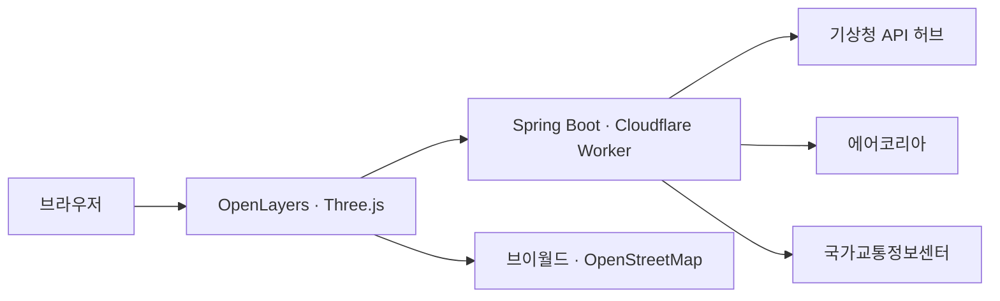

- **화면** OpenLayers 10, Three.js, 바닐라 JS, CSS
- **서버** Java 17 · Spring Boot, Cloudflare Workers
- **테스트** JUnit, Node.js 테스트 러너, Playwright

몇 가지 정한 것들:

- **격자점마다 API를 부르지 않습니다.** 화면 한 장이 3만 7천 격자인데 지점 예보 API로 채우면
  수천 번 호출이 됩니다. 전체 격자를 한 번에 주는 API로 요소당 1회만 부르고 캐시합니다.
- **화면 좌표 계산을 서버와 브라우저가 같은 식으로 합니다.** 한쪽만 바뀌면 히트맵이 지도와
  미세하게 어긋나므로, 렌더된 픽셀 색과 API 격자값이 맞는지 도법별로 검증하는 테스트를 둡니다.
- **UI는 무채색, 색은 데이터에만 씁니다.** 예전엔 컨트롤 강조색이 시안이었는데 풍속 3~4m/s가
  전체 격자의 40%라 화면 대부분이 같은 색으로 겹쳤습니다. 지금은 상태를 명도로 표현하고
  채도 있는 색은 기상 데이터와 특보 신호색만 씁니다.
- **Spring 배포와 Cloudflare 배포가 같은 화면 코드를 씁니다.** 정적 셸을 JSP에서 생성해
  두 환경의 DOM과 접근성 속성이 갈라지지 않게 합니다.

</details>

<br>

## 더 읽을 것

- [지금 되는 것과 안 되는 것](docs/known-limitations.md)
- [기여 방법](CONTRIBUTING.md)
- [보안 문제 신고](SECURITY.md)
- [사용한 오픈소스·데이터 고지](THIRD_PARTY_NOTICES.md)

이 저장소에는 오픈소스 라이선스를 걸어두지 않았습니다. 코드를 가져다 쓰려면 먼저 연락 주세요.
