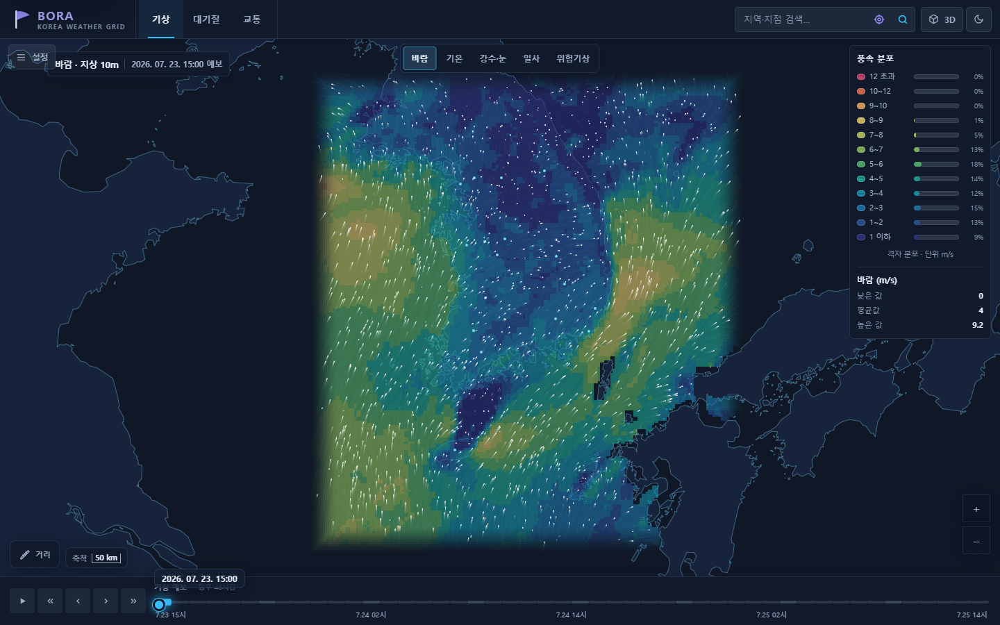
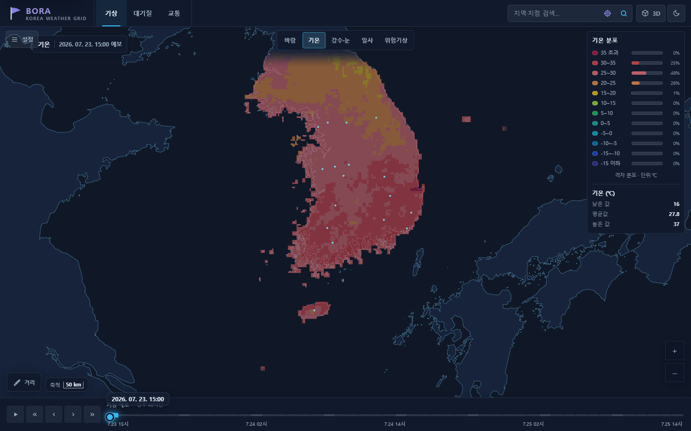
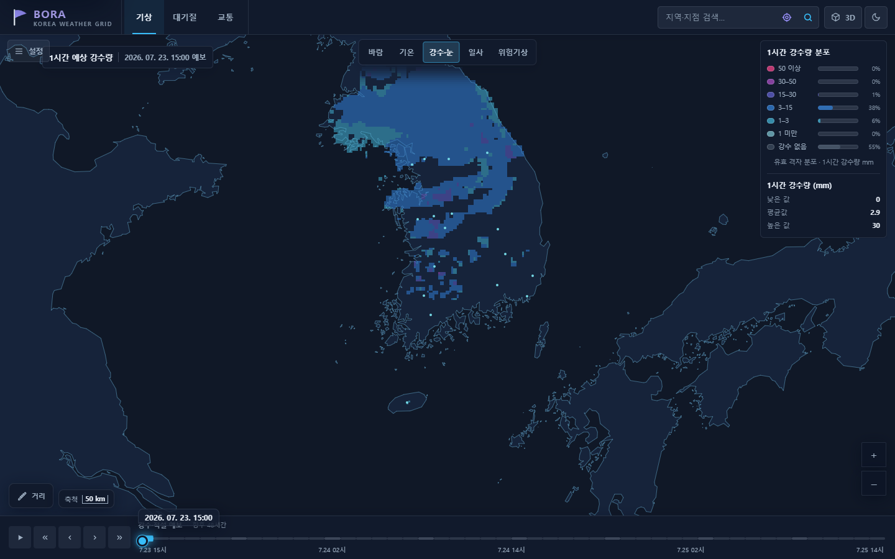
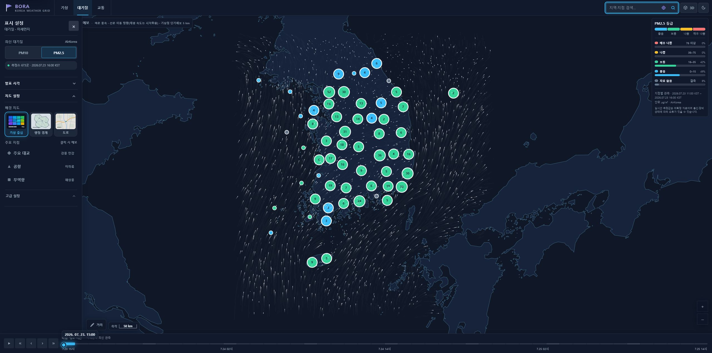
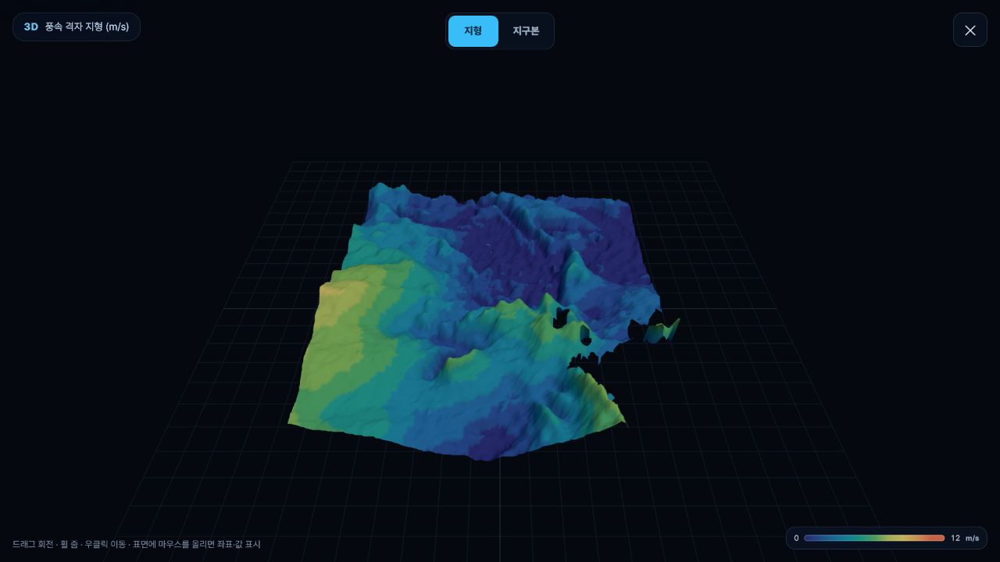
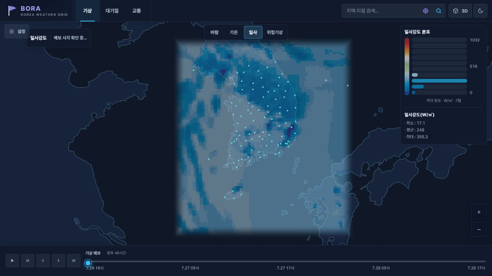

<p align="center">
  
</p>

<h1 align="center">BORA · Korea Weather Grid</h1>

<p align="center">
  전국의 기상 격자 예보를 지도와 시간축으로 탐색하는 웹 애플리케이션입니다.<br>
  바람의 흐름부터 기온·강수·습도·하늘상태·파고까지 한 화면에서 비교할 수 있습니다.
</p>

<p align="center">
  <a href="https://bora-weather.dlwnstndlwld.workers.dev"><strong>웹에서 BORA 열기</strong></a>
</p>



## BORA로 할 수 있는 일

- 전국 기상 분포를 색상, 흐름선, 등치선으로 비교
- 현재 발표 자료를 기준으로 향후 48시간 예보 탐색
- 지역 검색 또는 지도 선택으로 지점별 풍향·풍속 시계열 확인
- 범례에서 값의 범위와 전국 격자 분포 비율 확인
- 현재 기상장을 3D 지형 또는 지구본으로 탐색
- 대기질, 도로 CCTV, 위험기상 자료를 별도 레이어로 확인
- 거리 측정, 대표 지점 표시, 어두운 테마와 밝은 테마 전환

## 사용 방법

1. 상단에서 `기상`, `대기질`, `교통` 중 확인할 영역을 선택합니다.
2. 기상 화면에서는 `바람`, `기온`, `강수·눈`, `일사`, `위험기상`을 전환합니다.
3. 화면 아래 시간축을 움직여 같은 요소의 예보 변화를 비교합니다.
4. 지역 이름을 검색하면 해당 지점의 48시간 시계열을 열 수 있습니다.
5. `3D` 버튼으로 현재 분포를 입체 지형에서 확인합니다.

## 실제 동작 화면

아래 이미지는 저장소의 애플리케이션을 브라우저에서 직접 실행해 캡처했습니다.
별도로 데모라고 표시한 일사 화면을 제외하면 2026년 7월 23일 실데이터 응답으로
확인한 화면입니다.

<table>
  <tr>
    <td width="50%">
      
      <p align="center"><strong>기온 분포</strong><br>전국 격자와 구간별 비율</p>
    </td>
    <td width="50%">
      
      <p align="center"><strong>1시간 강수량</strong><br>강수 강도와 무강수 영역</p>
    </td>
  </tr>
</table>

### 지역별 48시간 예보


서울 좌표를 검색해 연 실제 화면입니다. 기상청 단기예보 응답으로 만든 48시간
풍향·풍속 시계열과 기온, 강수확률, 강수량, 습도, 파고를 시간대별로 함께 보여줍니다.

### 전국 대기질



AirKorea의 최신 PM2.5 관측을 등급별 측정소로 표시하고, 같은 시각의 바람 흐름을
함께 비교합니다. 캡처 시점에는 전국 673개 측정소 응답을 확인했습니다.

### 3D 기상 지형



드래그로 회전하고 휠로 확대할 수 있으며, 지형과 지구본 표현을 전환할 수 있습니다.

### 일사 분포



일사 화면은 KIM 하향단파복사 자료를 표현합니다. 현재 실데이터 원천을 불러오지 못해
위 캡처에는 로컬 데모 자료를 사용했습니다.

## 제공 정보와 현재 연결 상태

| 영역 | 제공 정보 | 현재 확인 상태 |
|---|---|---|
| 기상 격자 | 바람, 기온, 강수량, 강수형태, 적설, 습도, 하늘상태, 파고 | 실데이터 응답과 지도 렌더링 확인 |
| 일사 | 지면 하향단파복사 | 화면·범례 동작 확인, 실데이터 원천은 현재 미연결 |
| 지점 예보 | 48시간 풍향·풍속 차트, 시간대별 상세예보 | 기상청 실데이터 49개 시간대 응답과 화면 렌더링 확인 |
| 대기질 | PM10, PM2.5 측정소 | AirKorea 실데이터 응답과 전국 측정소 렌더링 확인 |
| 교통 | ITS 도로 CCTV와 HLS 영상 | 자격 증명은 연결됐으나 Cloudflare에서 ITS 원점 연결 시간 초과 확인 중 |
| 위험기상 | 기상특보, 태풍 경로, 최근 낙뢰 | 태풍·낙뢰 실데이터 응답 확인, 기상특보 캐시 원천 점검 필요 |
| 도로 배경지도 | Kakao Maps, OpenStreetMap 대체지도 | Kakao 제품 비활성 상태에서는 OpenStreetMap으로 자동 전환 |

외부 자료가 연결되지 않았을 때는 기상 지도를 유지하면서 해당 기능에 오류 안내와
재시도 버튼을 표시합니다. 예보와 관측 자료는 제공기관의 갱신 시각, 통신 상태,
자격 증명에 따라 달라질 수 있습니다.

## 로컬에서 실행하기

JDK 17이 필요합니다. 외부 API 없이 화면과 상호작용을 확인하려면 데모 모드를 사용합니다.

```bash
WEATHER_GRID_DEMO_MODE=true ./gradlew bootRun --args='--server.port=8080'
```

```powershell
$env:WEATHER_GRID_DEMO_MODE = "true"
.\gradlew.bat bootRun --args='--server.port=8080'
```

브라우저에서 [http://localhost:8080](http://localhost:8080)을 엽니다.

실제 자료를 사용하려면 필요한 키를 저장소 파일에 넣지 말고 실행 환경변수로 주입합니다.

| 환경변수 | 용도 |
|---|---|
| `KMA_API_AUTH_KEY` | 기상청 API Hub |
| `DATA_GO_KR_SERVICE_KEY` | AirKorea 등 공공데이터포털 API |
| `ITS_API_KEY` | 국가교통정보센터 CCTV |
| `KAKAO_MAP_JAVASCRIPT_KEY` | Kakao Maps JavaScript SDK |

Kakao 지도는 Kakao Developers에서 **카카오맵 사용 설정**을 켜고, 실제 실행 주소를
JavaScript SDK 도메인에 등록해야 합니다. 키나 SDK를 사용할 수 없으면
OpenStreetMap 도로지도로 자동 전환됩니다.

## 데이터 출처

| 데이터 | 출처 |
|---|---|
| 기상 예보 | 기상청 API Hub 단기예보·KIM 자료 |
| 대기질 | 한국환경공단 AirKorea 대기오염정보·측정소정보 |
| 도로 CCTV | 국가교통정보센터 ITS |
| 배경지도·경계 | Kakao Maps, OpenStreetMap contributors, Natural Earth 5.1.1 |

지도 경계는 시각화를 위한 자료이며 법적·지적 경계를 나타내지 않습니다. 기상 정보는
안전과 생명을 좌우하는 단독 판단 근거로 사용하지 말고 제공기관의 공식 발표를 함께
확인해 주세요.

## 더 알아보기

- [현재 제공 범위와 알려진 제한](docs/known-limitations.md)
- [기여 방법과 독립 구현 원칙](CONTRIBUTING.md)
- [보안 문제 비공개 신고](SECURITY.md)
- [외부 라이브러리와 데이터 고지](THIRD_PARTY_NOTICES.md)
