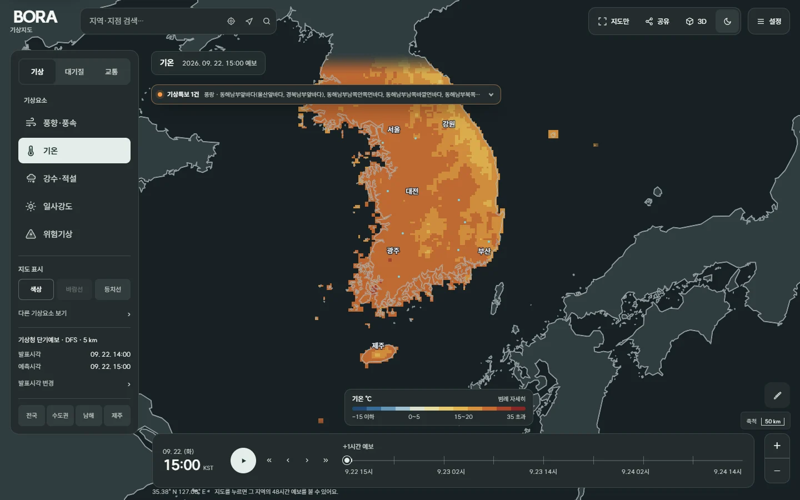

<h1 align="center">BORA 기상지도</h1>

  <strong>바람, 기온, 비 소식을 지도에서 확인하세요.</strong> 
  지역을 검색하거나 지도를 누르면 앞으로 48시간의 예보도 볼 수 있습니다.

  <strong>한국어</strong> · <a href="README.en.md" lang="en">English</a> · <a href="README.ja.md" lang="ja">日本語</a> · <a href="README.zh-CN.md" lang="zh-CN">简体中文</a>

  <a href="https://bora-weather.dlwnstndlwld.workers.dev"><strong>날씨 보러 가기 ↗</strong></a>

어디에 바람이 강하게 부는지, 밤사이 기온이 얼마나 내려가는지 지도를 보며 살펴보세요. 기상청 예보에 미세먼지 관측자료와 도로 CCTV를 더했습니다.

## 바람은 어느 쪽으로 불까?

움직이는 선은 바람이 부는 방향을, 지도의 색은 바람의 세기를 보여 줍니다. 색이 짙을수록 바람이 강한 곳입니다. 정확한 풍속은 아래 색상표나 지점을 눌렀을 때 나오는 수치로 확인하세요.

## 시간을 바꾸면 내일 날씨까지

화면 아래에서 시간을 바꿔 보세요. 같은 지역의 기온과 바람, 비 예보가 어떻게 달라지는지 비교할 수 있습니다. 재생 버튼을 누르면 시간이 차례로 넘어갑니다.

| 보고 싶은 날씨 | 고를 메뉴 |
| --- | --- |
| 바람이 어디로, 얼마나 강하게 부는지 | 풍향·풍속 |
| 지금부터 내일까지 얼마나 춥거나 더운지 | 기온 |
| 비나 눈이 오는 곳과 예상되는 양 | 강수·적설 |
| 햇볕이 얼마나 강한지 | 일사강도 |
| 습도, 하늘상태, 파도의 높이 | 다른 기상요소 보기 |
| 기상특보, 태풍 경로, 최근 낙뢰 | 위험기상 |

<table>
  <tr>
    <td width="50%">
<strong>기온</strong> · 어느 지역이 더 덥거나 추운지 비교해 보세요.
</td>
    <td width="50%">
<strong>일사강도</strong> · 지역과 시간에 따른 햇볕의 세기를 볼 수 있습니다.
</td>
  </tr>
</table>

## 우리 동네 날씨가 궁금하다면

지역명을 검색하거나 지도에서 원하는 곳을 누르세요. 앞으로 48시간의 기온, 강수확률, 습도, 바람을 볼 수 있습니다. 그래프 아래에는 시간별 예보가 나오고, 자세한 값은 수치표로 펼쳐 볼 수 있습니다.

## 휴대폰에서도 간편하게

위쪽 검색창에서 지역을 찾고, 아래쪽 버튼으로 날씨 종류와 시간을 바꾸면 됩니다. 지도 공유, 3D 보기, 밝은 화면·어두운 화면 전환은 오른쪽 위 설정에 있습니다.

  
  &nbsp;&nbsp;
  

## 미세먼지와 도로 상황 확인하기

**대기질**을 누르면 에어코리아 측정소의 미세먼지(PM10)와 초미세먼지(PM2.5) 농도를 볼 수 있습니다. 측정소를 누르면 관측시각과 등급도 나옵니다.

미세먼지는 **가장 최근의 관측값**입니다. 아래에서 시간을 바꿔도 미세먼지 농도는 바뀌지 않고, 함께 표시한 바람 예보만 바뀝니다.

**교통**에서는 지도를 확대해 주변 도로 CCTV를 찾을 수 있습니다. 카메라를 선택하고 재생 버튼을 누르면 영상에 연결합니다. 제공 기관의 연결 상태에 따라 일부 영상은 보이지 않을 수 있습니다.

## 이런 기능도 있어요

- **색상표 펼치기** — 지도 아래 색상표를 누르면 자세한 구간과 최저·평균·최고값이 나옵니다.
- **등치선 보기** — 기온이나 풍속이 같은 곳을 선으로 이어 봅니다.
- **거리 재기** — 지도에 점을 찍어 두 곳 사이의 직선거리나 여러 구간의 합계를 구합니다.
- **지도만 보기** — 메뉴를 접어 지도를 넓게 봅니다.
- **지도 공유** — 보고 있는 위치와 날씨, 예보시각이 담긴 링크를 복사합니다.
- **3D 보기** — 바람이 강할수록, 기온이 높을수록 높게 표시해 차이를 살펴봅니다. 지구본으로도 볼 수 있습니다. 화면의 높낮이는 실제 지형과 관계가 없습니다.

<table>
  <tr>
    <td width="50%">
<strong>등온선으로 보기</strong>
</td>
    <td width="50%">
<strong>거리 재기</strong>
</td>
  </tr>
  <tr>
    <td>
<strong>풍속을 높낮이로 보는 3D</strong>
</td>
    <td>
<strong>어두운 화면</strong>
</td>
  </tr>
</table>

키보드로도 사용할 수 있습니다. `/`는 지역 검색, `F`는 지도만 보기, `Esc`는 열린 창 닫기입니다.

## 날씨 자료는 어디서 오나요?

예보·기상특보·태풍·낙뢰는 **기상청**, 미세먼지는 **에어코리아**, 도로 CCTV는 **국가교통정보센터(ITS)** 자료를 사용합니다. 관측자료와 영상은 갱신이 늦거나 일시적으로 빠질 수 있습니다. 위험기상과 관련된 판단은 [기상청의 공식 발표](https://www.weather.go.kr/)도 함께 확인하세요.

화면 예시는 2026년 9월 22일에 촬영했습니다. 지도에 표시하는 시간은 한국 표준시(KST, UTC+9)이며, 바람선의 움직임은 방향을 보여 주기 위한 것으로 실제 이동 속도와는 다릅니다.

[자료 출처와 이용 조건](THIRD_PARTY_NOTICES.md) · [현재 이용할 수 없는 기능](docs/known-limitations.md) · [직접 실행하기](docs/getting-started.md) · [오류 제보](https://github.com/easygap/korea-weather-grid/issues)

프로젝트 코드의 라이선스는 아직 확정하지 않았습니다. 사용한 라이브러리·글꼴·데이터에는 각 제공자의 이용 조건이 적용됩니다.
